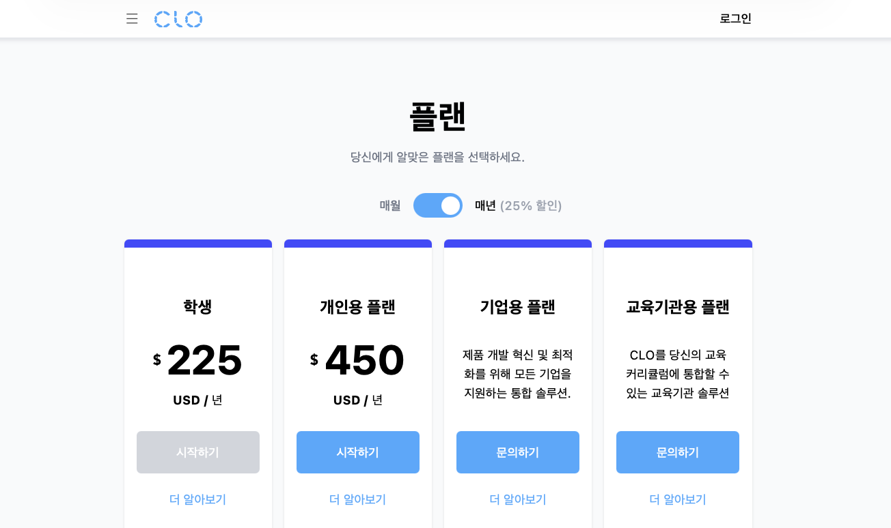

# clo-plans

CLO Plan 페이지를 바탕으로 코드 패턴을 보여주기 위한 프로젝트입니다.



## 기술 스택

- React, TypeScript, Vite
- Tailwind CSS v4
- React Router v7
- ESLint + oxfmt
- 패키지 매니저: bun

## 시작 방법

```bash
bun install

bun run dev       # 개발 서버 (기본 포트 5173)
bun run build     # 프로덕션 빌드
bun run preview   # 빌드 프리뷰
```

## 폴더 구조

```
src/
├── main.tsx                          # 엔트리
├── app/
│   └── app.tsx                       # 라우팅/레이아웃 루트
├── pages/
│   └── home/
│       ├── home-page.tsx             # 홈 페이지 컨테이너
│       ├── home-page.plans.tsx       # 플랜 섹션 (가격 카드)
│       ├── home-page.comparison.tsx  # 플랜 비교 표
│       └── home-page.faq.tsx         # FAQ 섹션
└── shared/
    ├── constants/                    # 공통 상수
    ├── icon/                         # SVG 아이콘 컴포넌트
    ├── styles/                       # 전역 스타일 / CSS 변수
    ├── ui/                           # 재사용 UI 컴포넌트
    └── utils/                        # 유틸 헬퍼 (cn)
```

## 설계 원칙

리팩토링하며 정리한 코드 작성 기준입니다.

### 1. 디자인과 코드가 1:1로 대응되도록 설계하였습니다.

무의미한 코드 분리는 지양하고, 주석없이도 코드만 보았을 때 UI가 바로 떠오를 수 있도록 설계하였습니다.

```md
<타이틀 영역 (플랜, ...)>
<스위치 (매월, 연간)>
<카드 목록>
```

```tsx
// home-page.plans.tsx
export function HomePagePlans() {
  const [isYearly, setIsYearly] = useState(true);
  return (
    <section ...>
      <div ...>
        <PlanTitle title="플랜" subtitle="당신에게 알맞은 플랜을 선택하세요." />
        <Spacing size={40} />
        <BillingSwitch left="매월" right={...} checked={isYearly} onCheckedChange={setIsYearly} />
        <Spacing size={32} />
        <PlanCardList plans={PLANS} isYearly={isYearly} />
      </div>
    </section>
  );
}
```

시선의 이동없이 컴포넌트 내부로 들어가지 않아도 무엇이 그려지는지 알 수 있습니다.

```tsx
// ❌ — 네이밍을 제외하곤 어떤 동작인지 알 수 없음
<BillingSwitch />

// ✅ — 호출부만 보아도 바로 라벨 및 스위치의 동작으로 알 수 있음
<BillingSwitch
  left="매월"
  right={<>매년 <span className="text-gray-400">(25% 할인)</span></>}
  checked={isYearly}
  onCheckedChange={setIsYearly}
/>
```

<br/>

### 2. 공용 상수, 유틸 및 UI는 shared에서 관리

공용으로 사용하는 파일을 `shared`로 분리하여 재사용 기준을 만들었습니다.

오버 엔지니어링이 되지 않도록 최소한의 분리를 진행하였습니다.

<br/>

### 3. Comparison 구조 설계

`<ComparisonGroup />`하나의 컴포넌트로 분리할 수 있었지만,

코드 내부로 들어가지 않아도 `ComparisonRow`의 형태를 바로 보여줄 수 있도록 자식 패턴으로 설계하였습니다.

초기에는 `renderItems`패턴으로 설계하였으나 `items`를 내부에서 사용하지 않아 아래와 같이 리팩토링하였습니다.

```tsx
<>
  {
    COMPARISON_COLUMNS.map(({ title, items }) => (
      <ComparisonGroup key={title} title={title}>
        {items.map((item) => (
          <ComparisonRow
            key={item.label}
            icon={<CheckCircleIcon className="size-7.5 shrink-0 text-[#197ad3]" />}
            href={item.href}
            label={item.label}
            eligibility={item.eligibility}
          />
        ))}
      </ComparisonGroup>
    ));
  }
</>
```

<br/>

### 4. 트레이드오프를 인지한 추상화

`home-page.tsx`에서 바로 구조가 보이지 않는 트레이드오프를 인지하고 추상화를 진행하였습니다.

해당 영역을 일부만 드러낼 경우, 추상화 레벨이 달라 오히려 코드의 가독성이 떨어졌습니다.

추상화 레벨을 동일하게 맞추고, 대신 컴포넌트 네이밍을 통해 해당 코드를 인지할 수 있도록 작성하였습니다.

```tsx
export function HomePage() {
  return (
    <div className="flex flex-1 flex-col pb-10">
      <HomePagePlans />
      <HomePageComparison />
      <HomePageFAQ />
    </div>
  );
}
```
